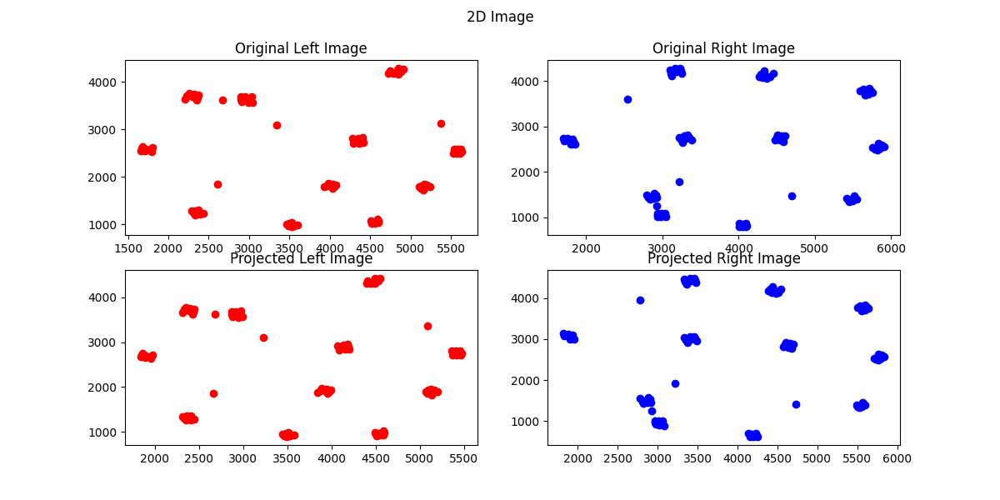
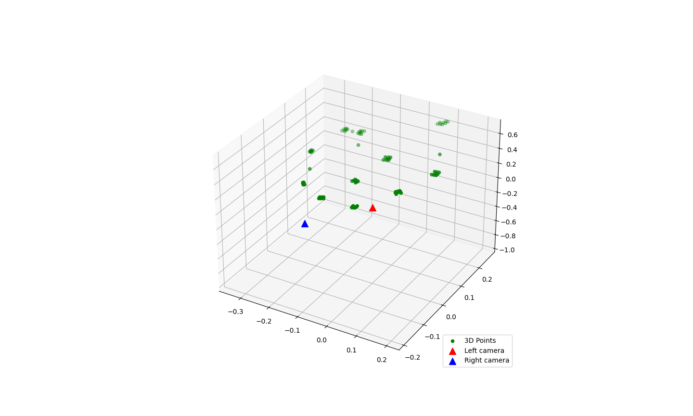

# 项目概述

本项目实现了从双目图像中提取特征点，计算本质矩阵、基础矩阵、旋转矩阵和平移向量，并通过三角化方法恢复三维点坐标。最后，对计算结果进行了可视化展示。

# 环境配置

## 使用 `pip` 安装依赖

```sh
pip install -r requirements.txt
```

# 项目结构

```
.
├── main.py                  # 主程序，实现特征点提取、矩阵计算、三角化和可视化
├── src
│   └── getpoints.py         # 从图像中提取特征点的函数
├── requirements.txt         # 项目依赖库
├── README.md                # 项目说明文档
└── 1.pix                    # 输入数据文件
```

# 代码功能

## 数据读取与特征点提取

- `read_data(file_path)`: 从文件中读取数据并解析为图像标志、特征点号、x坐标和y坐标。
- `extract_points(data)`: 从数据中提取左右目的特征点。
- `match_points(left_points, right_points)`: 匹配左右目的特征点。
- `create_point_matrix(matched_points)`: 将匹配的特征点转换为矩阵形式。

## 归一化与矩阵计算

- `normalize_points(points, K)`: 将特征点坐标归一化。
- `compute_essential_matrix(left_norm, right_norm)`: 从归一化的特征点计算本质矩阵 $E$。
- `compute_fundamental_matrix(E, K)`: 计算基础矩阵 $F$。

## 旋转矩阵与平移向量

- `decompose_essential_matrix(E)`: 分解本质矩阵 $E$ 得到旋转矩阵 $R$ 和平移向量 $t$。
- `triangulate_points(left_points, right_points, R, t, K)`: 通过三角化计算三维点。
- `find_valid_R_t(R_list, t_list, left_matrix, right_matrix, K)`: 遍历所有可能的 $R$ 和 $t$ 组合，找到有效的旋转矩阵和平移向量。

## 重投影误差计算

- `compute_reprojection_error(points_3d, left_points, right_points, K, R, t)`: 计算重投影误差。

## 可视化

- `visualize(points_3d, left_points, right_points, projected_left, projected_right, t)`: 可视化重投影后的图像和三维点。

# 运行流程

1. **数据读取与特征点提取**：从 `1.pix` 文件中读取数据，提取左右目的特征点并进行匹配。
2. **归一化与矩阵计算**：对特征点进行归一化处理，计算本质矩阵 $E$ 和基础矩阵 $F$。
3. **旋转矩阵与平移向量**：通过分解本质矩阵 $E$ 得到旋转矩阵 $R$ 和平移向量 $t$，并通过三角化方法恢复三维点坐标。
4. **重投影误差计算**：计算重投影误差，评估模型的准确性。
5. **可视化**：展示原始图像、重投影图像以及三维点的空间分布。

# 结果展示

运行 `main.py` 后，程序将输出以下内容：

- 左右目的重投影误差。
- 旋转矩阵 $R$ 和平移向量 $t$。
- 基础矩阵 $F$。
```sh
目误差: 8.021071761106057, 右目误差: 8.411881120453238
旋转矩阵 R: 
[[-0.25246253 -0.88535053  0.39040634]
 [ 0.85093357 -0.01107402  0.52515657]
 [-0.46062428  0.46479221  0.75617027]]
平移向量 t: 
[-0.61115925 -0.73729028  0.28790175]
基础矩阵 F: 
[[ 4.27370310e-09 -1.53327532e-08 -1.27408419e-04]
 [-1.59966775e-08  1.31731705e-09  1.81748904e-04]
 [-1.25139029e-04 -8.02518141e-05  9.45138320e-01]]
```
- 可视化结果：包括原始图像、重投影图像以及三维点的空间分布。





# 依赖库

- `numpy`: 用于数值计算。
- `matplotlib`: 用于绘图。
- `opencv-python`: 用于图像处理。

# 注意事项

- 本项目假设输入的图像数据已经过校正，且特征点已经匹配。
- 内参矩阵 $K$ 需要根据实际相机参数进行调整。
